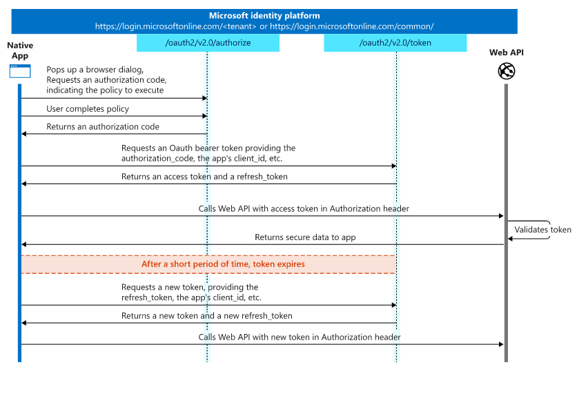

# Azure Active Directory

This document is created to describe how this sample application utlizes Azure AD to authenticate into the required services.

## Client Side React Application

This section describes the client side web application that Agents will use to talk to the server side (Api) below.

The client side application was built using the [msal-browser](https://github.com/AzureAD/microsoft-authentication-library-for-js/tree/dev/lib/msal-browser) (link 1) library which is now being recommended by the Microsoft Azure AD Product team. This library utilizes [PKCE](https://github.com/AzureAD/microsoft-authentication-library-for-js/tree/dev/lib/msal-browser#oauth-20-and-the-implicit-flow-vs-authorization-code-flow-with-pkce) (link 2) authentication as there are implications of utilizing [implicit flow](https://tools.ietf.org/html/draft-ietf-oauth-browser-based-apps-04#section-9.8.6) (link 3).

Essentially the user will login to the page just as if they did when they log into their [Office 365](https://www.office.com/) (link 3) account.

The PCKE flow is explained in more detail at [this page](https://docs.microsoft.com/en-us/azure/active-directory/develop/v2-oauth2-auth-code-flow) (link 5) and in this diagram.

This token only has permissions to talk to the Api server below and it looks similar to:

```json
{
  "typ": "JWT",
  "alg": "RS256",
  "kid": "YMELHT0gvb0mxoSDoYfomjqfjYU"
}.{
  "aud": "22ac2645-e500-4469-96b5-9ee67ada8d48",
  "iss": "https://login.microsoftonline.com/1e1a5e3a-f0ea-45c9-9d80-d88e4d8ed378/v2.0",
  "iat": 1587051057,
  "nbf": 1587051057,
  "exp": 1587054957,
  "aio": "AXQAi/8PAAAAynPgfYi/Q/Qjs/FvxGH2fOPgYS+MxTGnmjhfYuK4BfWkjlD1BfmsAR+kIcfuDkUgTofAzte8tTFWHBhOmlpVDTV4fnbRgMTydPwkshP/9wWQwEk6TNWPN8UaASd3+dO+XxyBB8f7qYiUSjofJ5LP6w==",
  "azp": "83e21d9a-9734-48f7-b53b-96fd8040979a",
  "azpacr": "0",
  "name": "Justin Wendlandt",
  "oid": "280b14db-a489-4e07-89e4-a85d87a78636",
  "preferred_username": "justin@jwendl.net",
  "scp": "access_as_user",
  "sub": "Gwa3fJVrhiLA0yS_hMA4FAtI8tH0jWGP098flIOBcPg",
  "tid": "1e1a5e3a-f0ea-45c9-9d80-d88e4d8ed378",
  "uti": "lX_Miwzg2EiEJnBP0PccAA",
  "ver": "2.0"
}.[Signature]
```



## Server Side Api Services

This section describes what the service application registration takes care of.

The Api will take the token passed to it from the single page application and will verify that the audience, issuers, signing key and lifetime are all valid based on the configuration deployed to the server.

Then the Api will take that bearer token and utilize an [on-behalf-of](https://docs.microsoft.com/en-us/azure/active-directory/develop/v2-oauth2-on-behalf-of-flow) (link 6) flow to take that user assertion token and give it the appropriate scopes for [Microsoft Graph](https://developer.microsoft.com/en-us/graph/) (link 7) and more specifically the [Create onlineMeeting api](https://docs.microsoft.com/en-us/graph/api/application-post-onlinemeetings?view=graph-rest-1.0&tabs=http) (link 8).

Then the Api server will use that newly created access token to make a call out to the [Create onlineMeeting api](https://docs.microsoft.com/en-us/graph/api/application-post-onlinemeetings?view=graph-rest-1.0&tabs=http) (link 8).

This token will only have access to call out to the onlineMeeting endpoint and will look something like:

``` json
{
  "typ": "JWT",
  "nonce": "6CqJVkeEFVae6P_EUPimdjRTLlhWRo9PyG55IqVtuao",
  "alg": "RS256",
  "x5t": "YMELHT0gvb0mxoSDoYfomjqfjYU",
  "kid": "YMELHT0gvb0mxoSDoYfomjqfjYU"
}.{
  "aud": "https://graph.microsoft.com",
  "iss": "https://sts.windows.net/1e1a5e3a-f0ea-45c9-9d80-d88e4d8ed378/",
  "iat": 1587052091,
  "nbf": 1587052091,
  "exp": 1587055467,
  "acct": 0,
  "acr": "1",
  "aio": "AUQAu/8PAAAA0xuQ73ttEiRGbHi2L2L3s2SoSSpQV7HPedy84kZ8M7O1TVGk1ywSsykzoDBWOOEQdjrpPNyDfrLaZjPgBREPnQ==",
  "amr": [
    "rsa",
    "mfa"
  ],
  "app_displayname": "WalgreensDemo-Server",
  "appid": "22ac2645-e500-4469-96b5-9ee67ada8d48",
  "appidacr": "1",
  "deviceid": "24618e8f-9d1e-46c3-8519-36c03f7272ca",
  "family_name": "Wendlandt",
  "given_name": "Justin",
  "ipaddr": "24.19.160.148",
  "name": "Justin Wendlandt",
  "oid": "280b14db-a489-4e07-89e4-a85d87a78636",
  "platf": "3",
  "puid": "100300008B558E40",
  "scp": "OnlineMeetings.ReadWrite User.Read profile openid email",
  "sub": "B7as5qL-IWl4gzSDDLmbGuTA2R9-uXZWiCvahJcKQ-E",
  "tid": "1e1a5e3a-f0ea-45c9-9d80-d88e4d8ed378",
  "unique_name": "justin@jwendl.net",
  "upn": "justin@jwendl.net",
  "uti": "21kludR6ikydM-W6ackdAA",
  "ver": "1.0",
  "wids": [
    "62e90394-69f5-4237-9190-012177145e10"
  ],
  "xms_st": {
    "sub": "Gwa3fJVrhiLA0yS_hMA4FAtI8tH0jWGP098flIOBcPg"
  },
  "xms_tcdt": 1408417112
}.[Signature]
```
## Reference Links

1. <https://github.com/AzureAD/microsoft-authentication-library-for-js/tree/dev/lib/msal-browser>
1. <https://github.com/AzureAD/microsoft-authentication-library-for-js/tree/dev/lib/msal-browser#oauth-20-and-the-implicit-flow-vs-authorization-code-flow-with-pkce>
1. <https://tools.ietf.org/html/draft-ietf-oauth-browser-based-apps-04#section-9.8.6>
1. <https://www.office.com/>
1. <https://docs.microsoft.com/en-us/azure/active-directory/develop/v2-oauth2-auth-code-flow>
1. <https://docs.microsoft.com/en-us/azure/active-directory/develop/v2-oauth2-on-behalf-of-flow>
1. <https://developer.microsoft.com/en-us/graph/>
1. <https://docs.microsoft.com/en-us/graph/api/application-post-onlinemeetings?view=graph-rest-1.0&tabs=http>